## 架構圖

架構圖待補
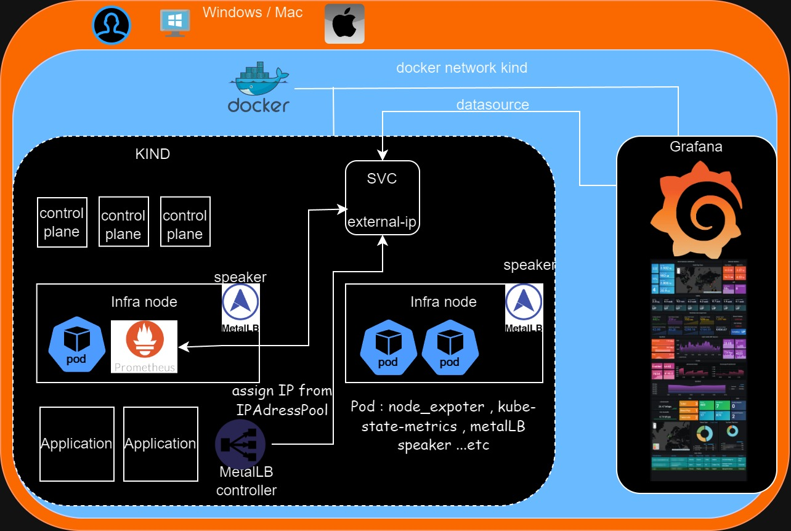

1. 請以kind (https://kind.sigs.k8s.io/) 架設一個3個control-plane 節點，以及4個worker 節點 。
   因docker in docker 且起 7 個 node , mac直接資源不夠 找了平常不做工作用的電腦來做此次kind部署
   
3. 節點分為2群角色或功能:Infra node: 4個worker中的2個節點 作為infra node。 Application node: 4 個worker 中的2 個節點 作為 application node。
   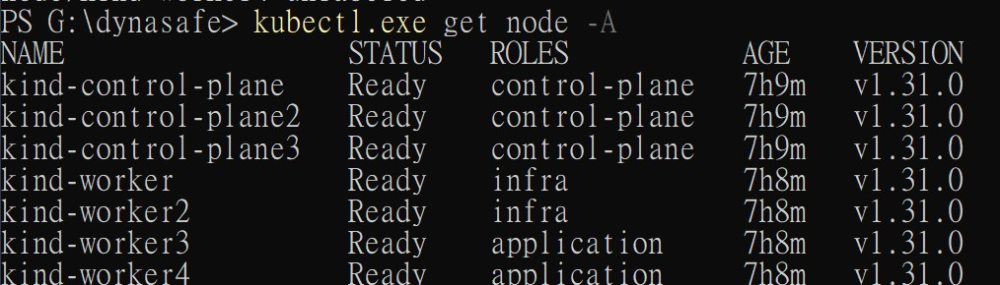

   直接apply 下面yaml 看一下 
   ```yaml
    kind: Cluster
    apiVersion: kind.x-k8s.io/v1alpha4
    nodes:
      - role: control-plane
      - role: control-plane
      - role: control-plane
      - role: worker
      - role: worker
      - role: worker
      - role: worker
    ```
   再改node label 2 infra , 2 application
   

3.安裝 MetalLB ，以L2 模式安裝，speaker 部署在 infra node上。
   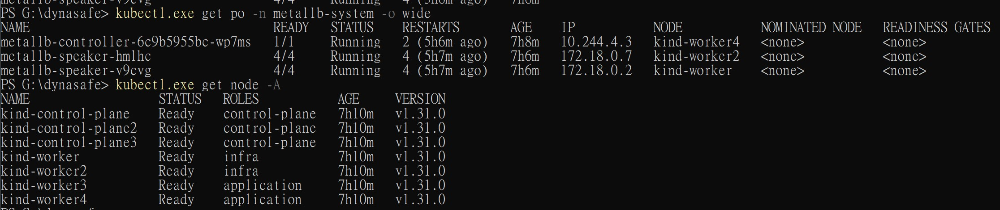

   這邊就沒用過, 研究了一下 , 一些文章用0.12 版本 安裝方式有點差異

   ```shell
    kubectl apply -f https://raw.githubusercontent.com/metallb/metallb/v0.12.1/manifests/namespace.yaml
    kubectl apply -f https://raw.githubusercontent.com/metallb/metallb/v0.12.1/manifests/metallb.yaml
   ```

後來直接用helm 來裝 再配置IPAddressPool & L2Advertisement , 這邊還有重點需要先

   ```shell
        docker network inspect -f '{{.IPAM.Config}}' kind
   ```
看一下docker kind 網段 , IPAddressPool range 需在這段裡面

```yaml
        apiVersion: metallb.io/v1beta1
        kind: IPAddressPool
        metadata:
          namespace: metallb-system
          name: default
        spec:
          addresses:
          - 172.18.0.240-172.18.0.250
```
發現改speak daemonset nodeSelectors 到 infra node .
這邊為了讓本機連上踩了一堆坑因Mac & Windows container network 不會expose 給 host , 所以需要加虛擬網卡&tunnel 讓 host 和 docker brige 連通.

4. 安裝 Prometheus, node exporter, kube-state-metrics 在infra node 節點上，Prometheus 收集node exporter, kube-state-metrics的效能數據。
   直接透過 helm裝prometheus  , 因需要只deploy infra node , 修改 node_exporter daemonset 到 infra node
   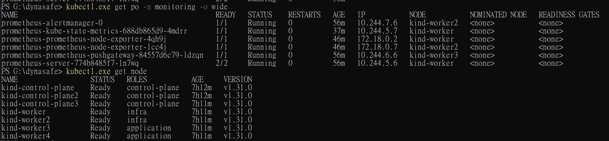

   values.yaml 就需要的enable
   ```
    helm install prometheus prometheus-community/prometheus -f values.yaml --namespace monitoring
   ```

6. 安裝 Grafana 在kind叢集外，以docker或podman 執行，datasouce指向 Prometheus，並呈現3個效能監控儀表板。
   ```shell
       docker run -d --name grafana --network kind -p 3001:3000 grafana/grafana
   ```
   因Step 3. 搞本機連Extnernal-ip 太久直接grafana network 用kind 分別用node port & loadbalancer 加到datasource , dashboard隨便拉一點
   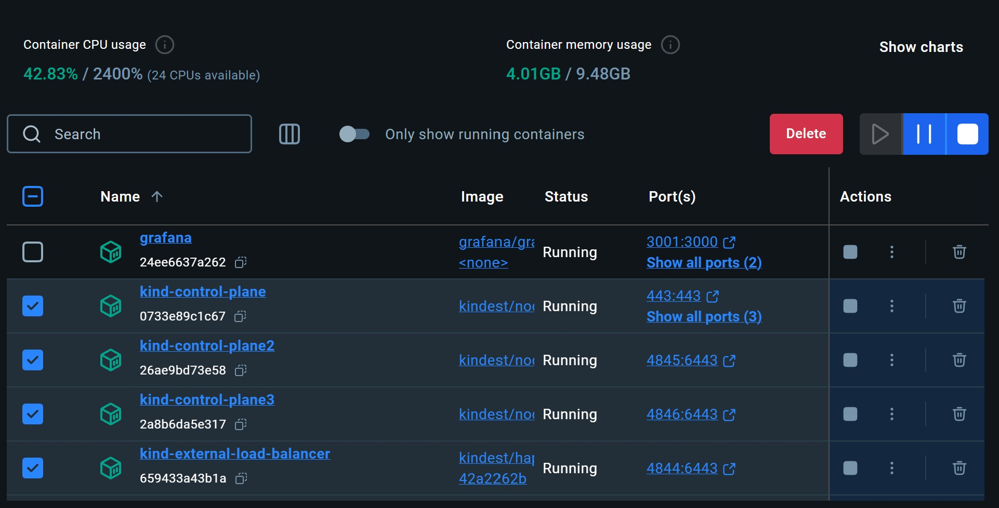
   先用NodePort 
   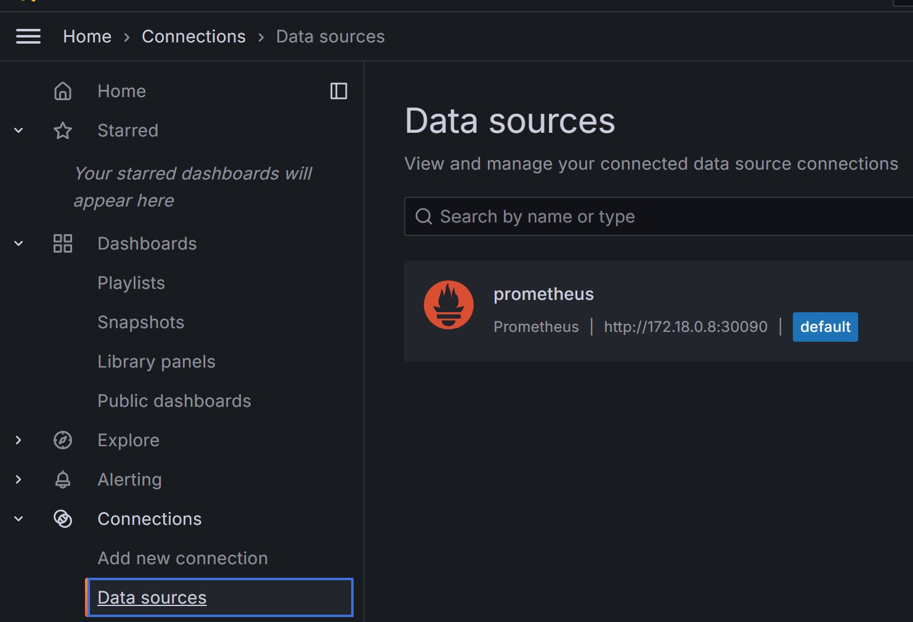
   想到第step 3有local localLB 改用 prometheus-server type 改用LoadBalancer
   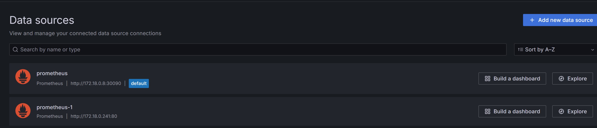
   隨便拉點 Dashboard 
   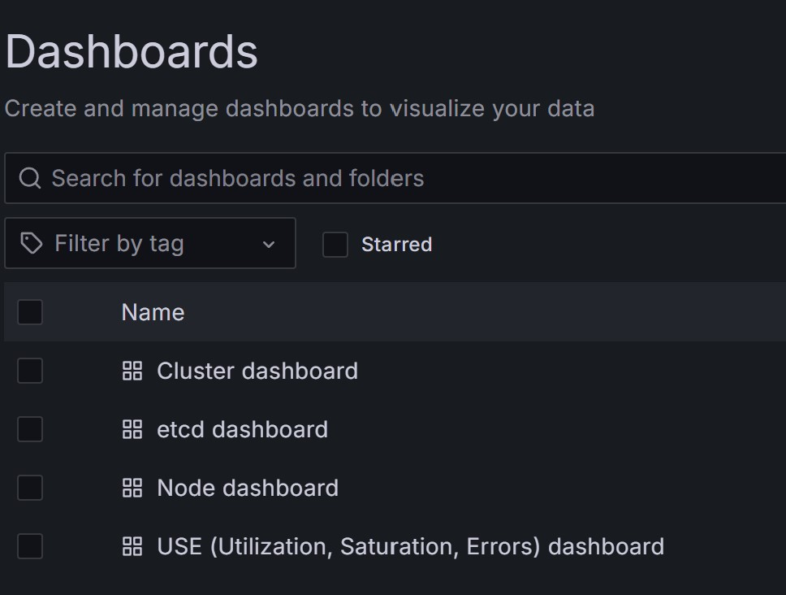
   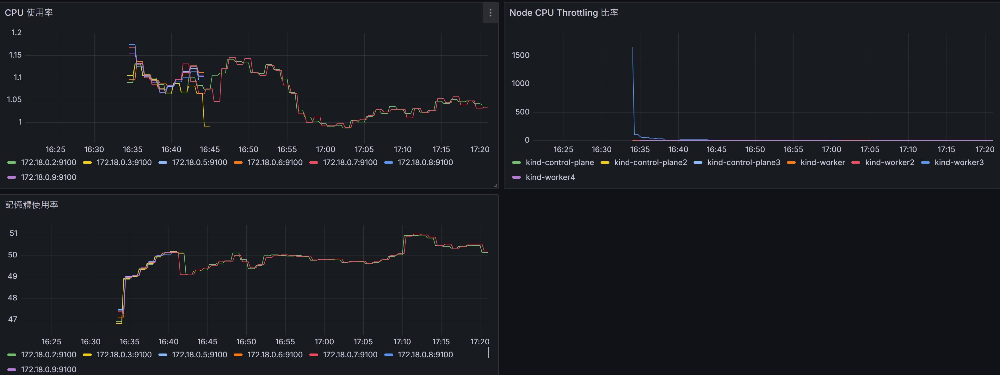
   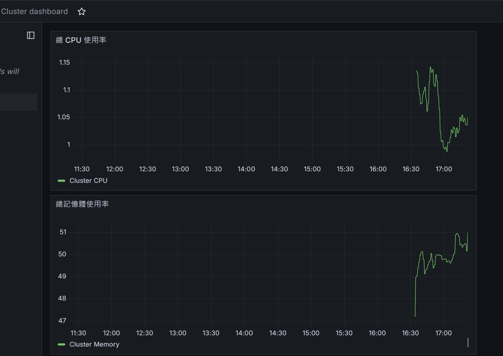
   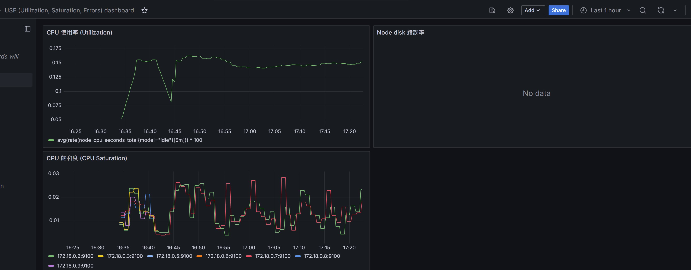
   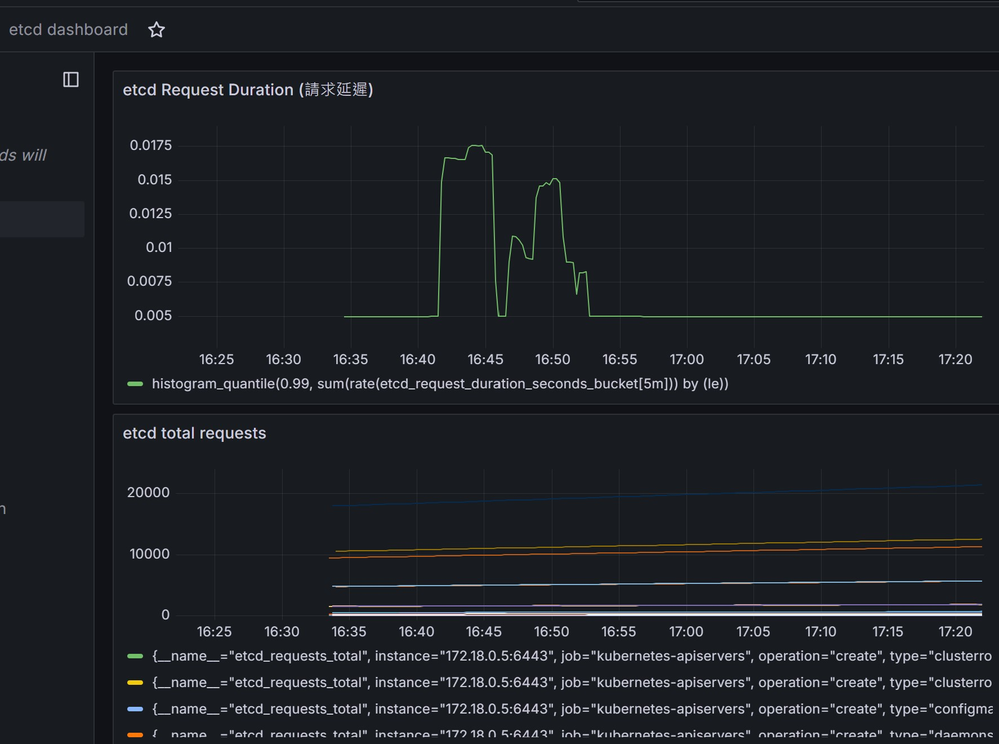
   發現要prometheus dashboard 隨便拉一點
   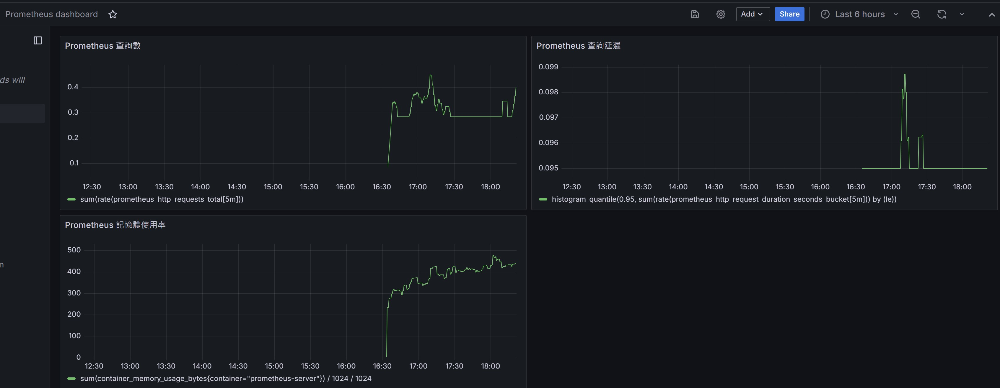

   CPU Throttling 在 node dashboard裡面
   就可以觀察CPU 對於每個node上的使用效率之類 , 在目前公司會多用PSI 相關metrics 來觀察整體負載狀況而不只觀察 CPU Throttling
   
   
6.請部署一個容器應用程式在application node，建立一個hpa物件以cpu 使用率到達50%為條件，最多擴充到10個pod。
  直接用 GPT 了 看起來只是要HPA 的基本設定 ,  目前實際狀況都是用KEDA 做autoscaling , 公司內用php 實際CPU 還沒到滿載就需要擴充
  cluster level 雲上搭配karpenter做 autoscaling
  
# Kubernetes HPA 架構說明
## 操作方法
### 部署應用程式
1. 創建 `example-deployment.yaml` 文件：

    ```yaml
    apiVersion: apps/v1
    kind: Deployment
    metadata:
      name: example-deployment
    spec:
      replicas: 3
      selector:
        matchLabels:
          app: example
      template:
        metadata:
          labels:
            app: example
        spec:
          nodeSelector:
            node-role.kubernetes.io/application: "true"
          containers:
          - name: example
            image: nginx
            ports:
            - containerPort: 80
    ```

2. 使用 `kubectl` 命令來部署應用程式：

    ```sh
    kubectl apply -f example-deployment.yaml
    ```

### 配置 HPA

1. 創建 `hpa.yaml` 文件：

    ```yaml
    apiVersion: autoscaling/v1
    kind: HorizontalPodAutoscaler
    metadata:
      name: example-hpa
    spec:
      scaleTargetRef:
        apiVersion: apps/v1
        kind: Deployment
        name: example-deployment
      minReplicas: 1
      maxReplicas: 10
      targetCPUUtilizationPercentage: 50
    ```

2. 使用 `kubectl` 命令來應用 HPA 配置：

    ```sh
    kubectl apply -f hpa.yaml
    ```

## 使用到的配置檔

- `example-deployment.yaml`: 部署應用程式的配置檔
- `hpa.yaml`: 配置 HPA 的配置檔

7. 請製作架構圖說明(圖檔)以上的架構以及操作的方法、使用到的配置檔(yaml, helm 等)、說明檔(以markdown格式呈現圖、內容)，上傳到github

   此ReadMe & Repo
